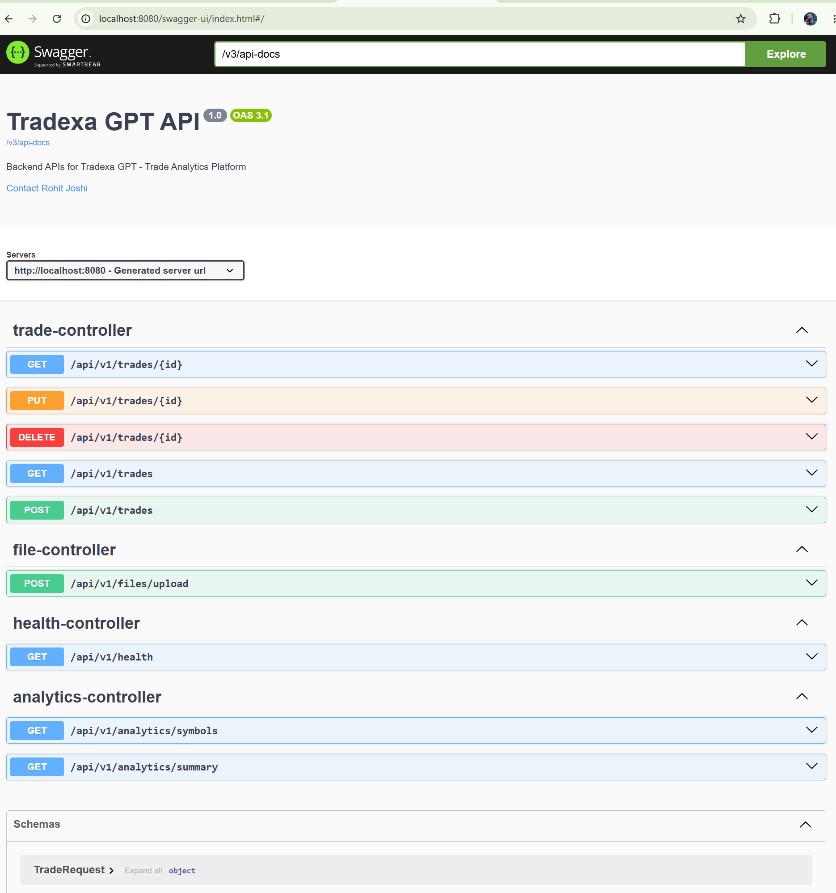

# 📈 Tradexa GPT Backend

Tradexa GPT is a production-style Spring Boot backend application that helps traders upload their trading journals, store trade history, analyze trading performance, and securely access APIs using JWT authentication.

The project is being developed following real-world backend engineering practices with a focus on clean architecture, scalability, and maintainability.

---

# 🚀 Tech Stack

- Java 21
- Spring Boot
- Spring Data JPA
- Spring Security
- JWT Authentication
- MySQL
- Hibernate
- Maven
- Apache Commons CSV
- Swagger / OpenAPI

---

# ✅ Features Implemented

## Trade Management

- Create Trade
- Update Trade
- Delete Trade
- Get Trade by ID
- Get All Trades

---

## CSV Upload

- Upload trading journal CSV
- Parse CSV using Apache Commons CSV
- Import trades into MySQL
- Fault-tolerant parsing
    - Invalid Strings → Empty
    - Invalid Numbers → 0
    - Parsing never stops because of bad rows

---

## Analytics Engine

Provides portfolio statistics including:

- Total Trades
- Winning Trades
- Losing Trades
- Win Rate
- Total Profit & Loss
- Average Profit
- Average Loss
- Symbol-wise Analytics

---

## Authentication & Security

- User Registration
- User Login
- BCrypt Password Encryption
- JWT Token Generation
- JWT Authentication Filter
- Protected REST APIs
- Spring Security Configuration

---

## Backend Engineering Concepts

- Layered Architecture
- DTO Pattern
- Entity Mapping
- Mapper Classes
- Constructor Dependency Injection
- Global Exception Handling
- Custom Exceptions
- Generic API Response Wrapper
- Repository Pattern
- Service Layer
- REST API Design

---

# 📂 Project Structure

```
src
├── config
├── controller
├── dto
├── entity
├── exception
├── mapper
├── parser
├── repository
├── security
├── service
└── util
```

---

# 📸 API Documentation

Swagger UI



---

# 🛠 Upcoming Features

### Testing

- JUnit 5
- Mockito
- Integration Testing

### API Improvements

- Pagination
- Sorting
- Filtering

### Performance

- Redis Caching

### Deployment

- Docker
- AWS Deployment

---

# 📌 Current Status

✅ CRUD APIs

✅ MySQL Integration

✅ CSV Upload

✅ Analytics Engine

✅ JWT Authentication

🚧 JUnit + Mockito (In Progress)

🚧 Pagination, Sorting & Filtering (Next)

---

# 📈 Future Roadmap

- Redis Cache
- Docker
- AWS EC2 Deployment
- CI/CD with GitHub Actions
- Role-Based Authorization (ADMIN / USER)
- Trade Dashboard APIs
- AI-powered Trade Insights

---

## 👨‍💻 Author

**Rohit Joshi**

Backend Developer | Java | Spring Boot | MySQL

GitHub: https://github.com/CoolMonkRJ
